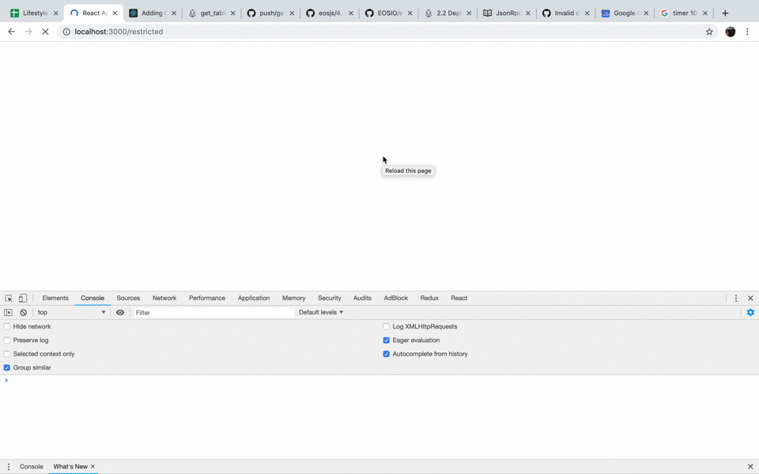

# MERN App with EOS Paid Restricted Sections

## Table of Contents

<!-- TOC depthFrom:1 depthTo:6 withLinks:1 updateOnSave:1 orderedList:0 -->

- [MERN App with EOS Paid Restricted Sections](#mern-app-with-eos-paid-restricted-sections)
	- [Table of Contents](#table-of-contents)
	- [1 | Description](#1-description)
	- [2 | Roadmap](#2-roadmap)
		- [2.1 Minimal Viable Product (MVP)](#21-minimal-viable-product-mvp)
	- [3 | Getting Started](#3-getting-started)
		- [3.1 Installing](#31-installing)
			- [3.1.1 Install dependencies in both `cd ./frontend` and `cd ./backend`](#311-install-dependencies-in-both-cd-frontend-and-cd-backend)
			- [3.1.2. In `./backend` create a new file `variables.env`.](#312-in-backend-create-a-new-file-variablesenv)
			- [3.1.3 In `./frontend`](#313-in-frontend)
			- [3.1.4 Scatter Wallet](#314-scatter-wallet)
		- [3.2 Running](#32-running)
			- [3.2.1 Running the Backend](#321-running-the-backend)
			- [3.2.2 Running the Frontend](#322-running-the-frontend)

<!-- /TOC -->

## 1 | Description

Modular authentication application made to isolate bugs with restricted paid section using EOS, and have one working authentication system to compare other apps implementing this protocol.

Restricted sections uses MongoDB, Express.js, React, and React-Native, and Node.js (MERN), as well as EOS and Scatter Wallet.



## 2 | Roadmap

### 2.1 Minimal Viable Product (MVP)

**Status:** In progress

- [x] Add authentication
- [x] Add API for restricted section
- [x] Configure User settings to display if user has role free user of premium user
- [x] Add EOS payments option once logged in to unlock restricted premium content
  - [x] Add activation page
  - [x] Link eosjs and scatter wallet
  - [x] Run a transaction to a company account
  - [x] Push transaction to server, have server update user role to premium if matching transaction found on the EOS blockchain `eosio.token` contract, unlocking premium restricted section
  - [x] make a POST api route for receiving the EOS account and transaction
  - [x] Conditional statement that updates user account unlocking restricted section access

## 3 | Getting Started

### 3.1 Installing

#### 3.1.1 Install dependencies in both `cd ./frontend` and `cd ./backend`

```
npm install || yarn
```

Authentication requires MongoDB to be installed on your system. MongoDB can be installed with [HomeBrew on Mac](https://treehouse.github.io/installation-guides/mac/mongo-mac.html)

#### 3.1.2. In `./backend` create a new file `variables.env`.

Add a secret key to `variables.env`. The secret key can be whatever you would like.
This step is optional for this app if not running for production.

```
AUTH_SECRET_KEY = "Secret Key"
```

And add your mongodb uri with your credentials in `variables.env`: This step is optional for this app if not running for production.

```
MONGO_URI = "Mongo uri with credentials"
```

And add credentials for a mailing client you will use to send your emails. Integrated services include Zoho, Gmail, and Outlook. This app uses nodemailer to send emails. This step is required for activating new user accounts and reseting passwords through this app.

Inside `./backend/variables.env`.

```
MAIL_USER = "your email"
MAIL_PASS = "your email password"
APP_NAME = "your app name or company name"
```

#### 3.1.3 In `./frontend`

This uses a local testnet using a local `eosio.token` smart contract. Instructions found in the EOS Dev Portal, getting started page, https://developers.eos.io/eosio-home/docs.

Add a `.env` file in the `./frontend` root. Add the chain id found in your nodeos info.

Found at http://localhost:8888/v1/chain/get_info

```
REACT_APP_CHAIN_ID=<your local chain ID>
```

#### 3.1.4 Scatter Wallet

This application requires Scatter Wallet to be installed, https://get-scatter.com/. You can configure scatter to your local testnet in settings > network. To add accounts you created. You can then create a network with settings found in http://localhost:8888/v1/chain/get_info.

You can then add accounts you create in cleos by inserting the private key for that account into Scatter and setting it to the localhost network you added.

The accounts this app uses is an account named james for the receiving account.

### 3.2 Running

You can run as a web app, mobile app, or desktop app.

#### 3.2.1 Running the Backend

You must run the backend first. The backend requires MongoD to be running first.

Inside `./backend`:

1. Begin MongoD.

```
mongod
```

2. Then run the server

```
npm run dev || yarn dev || npm run start || yarn start
```

Running the script `dev` will use `nodemon` which restarts the server upon
changes in code.

The back-end will be running in localhost:4000 with current settings.

You can see your mongodb

#### 3.2.2 Running the Frontend

The front-end will run in localhost:3000 with current settings.

Inside `./frontend`:


For Web:

```
npm run web || yarn web
```

For Mobile:

```
npm run start || yarn start || exp start
```

For Desktop:

```
npm run desktop || yarn desktop
```
